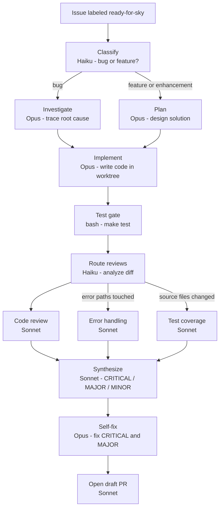

Use this when you want Skylence to take an issue from your backlog and handle the full engineering loop - understanding the problem, writing the code, running tests, and opening a pull request - without you doing anything except adding a label.

The workflow is adaptive: it detects whether the issue is a bug or a feature and picks the right approach. Bugs get a root-cause investigation first. Features get an implementation plan. Both go through a multi-agent code review before the PR is created, and critical findings are fixed automatically before the PR is opened.

**Trigger:** Add label `ready-for-sky` to issue.



```
⊕meta⊕
name = "fix-github-issue"
description = "Fix GitHub issue: classify → investigate/plan → implement → test → adaptive review → self-fix → PR"
trigger.github.events = ["issues.labeled"]
trigger.github.label = "ready-for-sky"
output_style = "terse"
⊕⊕

※※
This workflow fires when you add the "ready-for-sky" label to a GitHub issue.
From that single action it handles the full engineering cycle automatically: reading the
issue, understanding what kind of problem it is, writing the code to fix or build it,
running tests, reviewing its own work, fixing review findings, and opening a pull request.

You do not need to write any code. Label the issue and walk away.
※※

§classify§
model = "haiku"
§§

∆classify∆
Classify issue #{{issue.number}}.

Title: {{issue.title}}
Body: {{issue.body}}

Workflow (Mermaid):
flowchart TD
    in[Issue received] --> classify[Classify type]
    classify -->|bug| investigate[investigate node]
    classify -->|feature or enhancement| plan[plan node]
    investigate --> implement[implement in worktree]
    plan --> implement
    implement --> test[make test]
    test --> review[review agents in parallel]
    review --> synthesize[synthesize findings]
    synthesize --> self_fix[self-fix CRITICAL and MAJOR]
    self_fix --> pr[create draft PR]

Classification:
- bug: broken behavior, error, crash, regression
- feature: new capability, net-new
- enhancement: improve existing behavior
- refactor: cleanup, reorganize
- chore: dependencies, CI/CD, maintenance
- documentation: docs, readme, examples

Output ONLY valid JSON:
{"issue_type": "<type>", "reasoning": "<one sentence>"}
∆∆

※※
STEP 1 - CLASSIFY
A fast, cheap model (Haiku) reads the issue title and body and decides what kind of
problem this is: a bug, a feature request, an enhancement, or something else.
This takes only a few seconds. The result routes the rest of the workflow:
  - Bug → goes to INVESTIGATE (root cause analysis)
  - Feature or enhancement → goes to PLAN (implementation blueprint)
※※

§investigate§
model = "opus"
effort = "max"
depends_on = ["classify"]
when = "$classify.output.issue_type == 'bug'"
§§

∆investigate∆
Issue #{{issue.number}}: {{issue.title}}
Type: bug - $classify.output.reasoning

{{issue.body}}

Investigate bug:
1. Trace code path to failure.
2. Find root cause: exact file, function, line.
3. Check nearby code for related issues.
4. Propose minimal safe fix.
5. Identify tests to add or update.

Produce structured investigation report. No implementation yet.
∆∆

※※
STEP 2a - INVESTIGATE (bugs only, skipped for features)
The most capable model (Opus, maximum effort) reads through the codebase and traces the
exact path that leads to the bug: which file, which function, which line is responsible.
No code is changed at this stage. The result is a structured report describing the root
cause, the minimal safe fix, and which tests need to be added or updated.
This report is passed directly to the IMPLEMENT step.
※※

§plan§
model = "opus"
effort = "max"
depends_on = ["classify"]
when = "$classify.output.issue_type != 'bug'"
§§

∆plan∆
Issue #{{issue.number}}: {{issue.title}}
Type: $classify.output.issue_type - $classify.output.reasoning

{{issue.body}}

Create implementation plan:
1. List files needing change and why.
2. Per file: approach, risks, edge cases.
3. Define test strategy.
4. Note breaking changes.
5. Order changes to minimize risk.

Produce structured plan. No implementation yet.
∆∆

※※
STEP 2b - PLAN (features and enhancements only, skipped for bugs)
Same powerful model, different job: instead of finding what broke, it designs what to build.
It lists every file that needs changing and explains why, defines the test strategy, calls out
any breaking changes, and orders all the tasks to minimize risk.
This plan is passed directly to the IMPLEMENT step.
※※

§implement§
model = "opus"
effort = "max"
isolation = "worktree"
depends_on = ["investigate", "plan"]
trigger_rule = "one_success"
§§

∆implement∆
Issue #{{issue.number}}: {{issue.title}}

Investigation (if bug): $investigate.output
Plan (if feature/enhancement): $plan.output

Execute:
- Make changes. Run `make test` after each logical group. Fix failures.
- Commit changes referencing #{{issue.number}}.
- Push: `git push -u origin HEAD`.
∆∆

※※
STEP 3 - IMPLEMENT
Opus executes the investigation report or feature plan inside a completely isolated copy of
the codebase (a git worktree - a fresh branch that cannot affect your main branch).
It makes changes file by file, runs "make test" after each group of changes, fixes any
failures before continuing, commits everything referencing the issue number, and pushes
the branch to GitHub when done.
※※

§test§
bash = "make test"
depends_on = ["implement"]
§§

※※
STEP 4 - TEST GATE
An independent bash step runs "make test" after the implement step completes.
This acts as a hard gate before the review phase: if tests are still failing at this
point, the workflow catches it before spending time on multi-agent code review.
※※

§review-classify§
model = "haiku"
depends_on = ["implement"]
chain_from = "implement"
§§

∆review-classify∆
Analyze implementation branch. Decide which review agents to run.

Run `git fetch origin && git diff origin/main...HEAD`.

Rules:
- run_error_handling: "true" if diff touches error handling or changes error returns.
- run_test_coverage: "true" if diff modifies source files (not just tests or docs).
- run_docs_impact: "true" if diff adds/removes public APIs, CLI flags, env vars, or config keys.

Output ONLY valid JSON:
{"run_error_handling": "true|false", "run_test_coverage": "true|false", "run_docs_impact": "true|false", "reasoning": "<brief>"}
∆∆

※※
STEP 5 - ROUTE REVIEWS
A fast Haiku model reads the actual git diff - the real lines of code that changed - and
decides which of the three specialized review agents need to run.
If nothing touched error handling, the error-handling reviewer is skipped entirely.
If there are no source file changes, test-coverage review is skipped.
This keeps review fast and targeted rather than running every check on every change.
※※

§code-review§
model = "sonnet"
depends_on = ["review-classify"]
chain_from = "review-classify"
§§

∆code-review∆
Review implementation for issue #{{issue.number}}: {{issue.title}}.

Run `git fetch origin && git diff origin/main...HEAD`.

Check:
1. Correctness - solves issue? Off-by-one, nil dereferences, race conditions?
2. Edge cases - what inputs or states could break this?
3. Conventions - matches adjacent code patterns?
4. Security - injection, path traversal, auth bypass?

List findings: severity (critical/major/minor), file:line, what to fix.
Conclude: LGTM, LGTM with minor fixes, or NEEDS CHANGES.
∆∆

§error-handling§
model = "sonnet"
depends_on = ["review-classify"]
chain_from = "review-classify"
when = "$review-classify.output.run_error_handling == 'true'"
§§

∆error-handling∆
Review error handling for issue #{{issue.number}}.

Run `git fetch origin && git diff origin/main...HEAD`.

Check:
1. All errors handled - not silently swallowed?
2. Error messages specific enough for debugging?
3. Cleanup (defer, close, rollback) correct on all failure paths?

List findings: severity, file:line, what to fix.
∆∆

§test-coverage§
model = "sonnet"
depends_on = ["review-classify"]
chain_from = "review-classify"
when = "$review-classify.output.run_test_coverage == 'true'"
§§

∆test-coverage∆
Review test coverage for issue #{{issue.number}}.

Run `git fetch origin && git diff origin/main...HEAD`.

Check:
1. New/changed code paths covered?
2. Edge cases tested (empty inputs, boundary values, error paths)?
3. Tests assert behavior, not just exercise code?

List gaps: severity, what to add/fix.
∆∆

※※
STEPS 6a / 6b / 6c - PARALLEL REVIEWS
Up to three Sonnet agents run simultaneously, each focused on a different dimension:
  Code review     - correctness, edge cases, security, naming conventions
  Error handling  - are all errors caught? are messages useful? is cleanup correct?
  Test coverage   - are new code paths tested? are edge cases and boundaries covered?
Only the agents selected by the routing step actually run. All findings flow into SYNTHESIZE.
※※

§synthesize§
model = "sonnet"
depends_on = ["code-review", "error-handling", "test-coverage"]
trigger_rule = "one_success"
§§

∆synthesize∆
Synthesize review findings for issue #{{issue.number}}.

Code review: $code-review.output
Error handling: $error-handling.output
Test coverage: $test-coverage.output

Group by severity:
- CRITICAL: must fix before merging
- MAJOR: should fix before merging
- MINOR: non-blocking

If no issues: "LGTM - no fixes required."
∆∆

※※
STEP 7 - SYNTHESIZE
One Sonnet call collects every finding from whichever review agents ran and organizes
them by severity into a single consolidated report:
  CRITICAL - must fix before this PR can be merged
  MAJOR    - should fix before merging
  MINOR    - non-blocking, good to address but not required
※※

§self-fix§
model = "opus"
effort = "max"
depends_on = ["synthesize", "implement"]
chain_from = "implement"
§§

∆self-fix∆
Fix CRITICAL and MAJOR findings for issue #{{issue.number}}.

Findings: $synthesize.output

Continue from implementation branch. Run `git fetch origin && git checkout <branch>` if needed.

- Fix CRITICAL and MAJOR. Fix MINOR if trivial.
- Run `make test`. Commit and push.
- If "LGTM - no fixes required", confirm and stop.
∆∆

※※
STEP 8 - SELF-FIX
Opus goes back to the implementation branch and fixes every CRITICAL and MAJOR finding
from the review. It also fixes MINOR findings if they are trivial to address.
After fixing it runs the test suite again, commits the fixes, and pushes.
If the review concluded "no issues found", this step confirms and stops without changes.
※※

§create-pr§
model = "sonnet"
depends_on = ["test", "self-fix"]
trigger_rule = "all_done"
§§

∆create-pr∆
Create PR for issue #{{issue.number}}: {{issue.title}}.

Type: $classify.output.issue_type
Test: $test.output
Review: $synthesize.output

1. Confirm committed: `git status`
2. Push if needed: `git push -u origin HEAD`
3. Check existing: `gh pr list --head $(git branch --show-current)`
4. Create draft: `gh pr create --draft`
   - Title: imperative, under 70 chars
   - Body: summary, `Closes #{{issue.number}}`, review summary
∆∆
```
