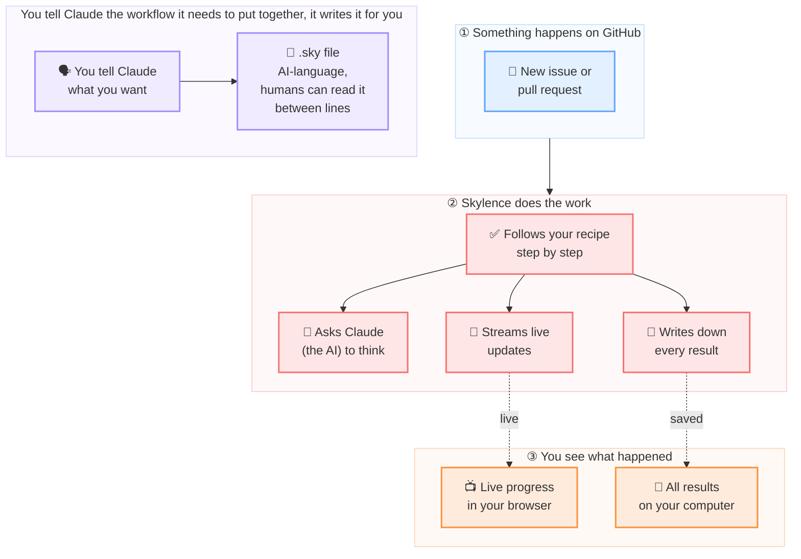

## What is Skylence?

Skylence is a Claude Code **harness builder**. You give it `.sky` workflow files; it builds and runs a harness for each matching GitHub event — calling the `claude` CLI, streaming results over WebSocket, and persisting everything locally.

## Why this exists

I saw a YouTuber demo [Archon](https://archon.diy), a Claude Code harness builder. I tried it myself with a couple of carefully designed workflows. Wiring authentication into a simple Laravel todos app took 45 to 50 minutes end to end. Too slow.

Later I ran across [Weft](https://weavemind.ai) from WeaveMindAI, a DAG language for AI workflows. And I noticed GitNexus had a web UI: running `gitnexus serve` hooks the CLI up to it.

Those three clicked. I wanted one file format that was AI-first, so Claude could author it with tight, performant prompts, but still readable enough for a human to review before it ships. Claude does not run the file itself. Skylence reads it, resolves the DAG, and shells out to the `claude` CLI for the thinking parts.

So I built `.sky`.

## How it works

1. A GitHub event (issue labeled, PR opened, …) triggers a matching workflow.
2. Skylence executes each node in dependency order — calling Claude, running shell commands, or making HTTP requests.
3. Every step is streamed live and stored locally. Nothing leaves your machine.

## Key capabilities

- **Structured workflows** — define multi-step DAGs with dependencies, conditions, and loops in `.sky` files.
- **Claude-native** — uses `claude` CLI sessions, MCP config, and isolation flags directly.
- **Cost controls** — per-node and monthly spend caps enforced before Claude is invoked.
- **Parse-time safety** — `sky lint` catches injection risks and schema errors before any workflow runs.
- **Local-first** — no account, no cloud backend. State stored in SQLite on your machine.
- **Live streaming** — run events stream over WebSocket to the [sandbox.skylence.be](https://sandbox.skylence.be) SPA.

## Where to go next

| | |
|---|---|
| [Installation](/installation/) | Install the `sky` binary |
| [Getting Started](/getting-started/) | Run your first workflow |
| [Workflow Format](/workflow-format/) | Learn the `.sky` file format |
| [CLI Reference](/cli/) | All commands and flags |
| [Configuration](/configuration/) | Config file and env vars |
| [Architecture](/architecture/) | How the pieces fit together |
