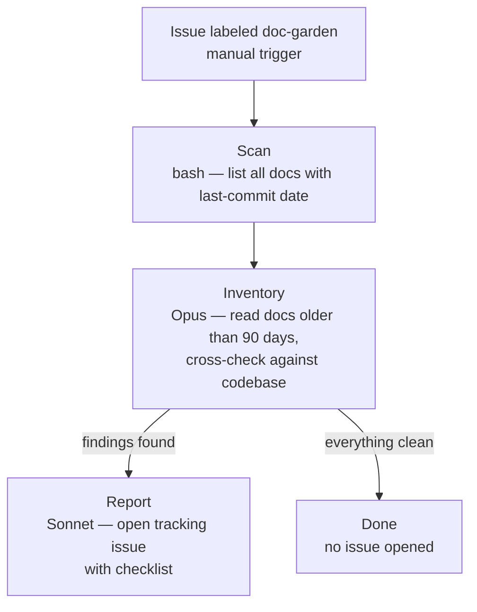

Gebruik dit om je documentatie te controleren op veroudering zonder alles handmatig door te lezen. De workflow controleert elke doc tegen de huidige codebase en markeert drie soorten problemen: verwijzingen naar symbolen of bestanden die niet meer bestaan, kwaliteitsbeoordelingen die niet overeenkomen met de werkelijke codestatus, en uitvoeringsplannen die zijn voltooid maar niet gearchiveerd.

De output is een GitHub tracking issue met een checklist — één item per verouderde doc. Als alles schoon is, wordt er geen issue geopend.

Draai dit periodiek — maandelijks of na een grote refactoring.

**Trigger:** Voeg label `doc-garden` toe aan issue (handmatige trigger).



```
⊕meta⊕
name = "doc-gardening"
description = "Scan docs/ for staleness; open tracking issue with findings"
trigger.github.events = ["issues.labeled"]
trigger.github.label = "doc-garden"
output_style = "terse"
⊕⊕

※※
This workflow fires when you add the "doc-garden" label to any issue — it is a manual trigger
used for periodic maintenance, not tied to a specific event. Run it monthly or after a large
refactor to catch documentation that has drifted out of sync with the codebase.

The output is a GitHub tracking issue with a checklist of stale docs.
If everything is up to date, no issue is opened and the workflow ends silently.
※※

§scan§
bash = "git ls-files 'docs/*.md' 'docs/**/*.md' | xargs -n1 -I F git log -1 --format='%cs F' -- F | sort; echo '---ACTIVE-PLANS---'; git ls-files 'docs/exec-plans/active/*' 2>/dev/null || true; echo '---TODAY---'; date -u +%Y-%m-%d"
§§

※※
STEP 1 — SCAN
A bash command lists every markdown file under docs/ along with the date it was last changed
in git. It also lists any active execution plans and today's date.
This produces a simple inventory of doc ages — the raw material for the next step.
No AI model runs here; it is just a git command.
※※

§inventory§
model = "opus"
effort = "max"
depends_on = ["scan"]
§§

∆inventory∆
Produce doc-staleness report from scan output.

Scan output (format: "YYYY-MM-DD path", then markers):
$scan.output

Analysis flow (Mermaid):
flowchart TD
    scan[Scan: dates and paths] --> filter[Filter docs older than 90 days]
    filter --> read[Read each old doc]
    read --> crosscheck[Cross-check with codebase]
    crosscheck -->|symbol gone| broken[broken-reference]
    crosscheck -->|grade wrong| outdated[outdated-grade]
    crosscheck -->|plan done| finished[finished-plan]
    crosscheck -->|still accurate| skip[Skip]
    broken --> report[report node]
    outdated --> report
    finished --> report
    report -->|findings| issue[Open tracking issue]
    report -->|clean| stop[Stop]

Per doc in scan:
1. Read doc if last-commit more than 90 days before today.
2. Skim recent git history for symbols, paths, flags doc references.
3. Flag:
   - broken-reference: cites symbol/path/flag no longer existing
   - outdated-grade: QUALITY_SCORE grades contradict current state
   - finished-plan: exec-plan in active/ has no open TODOs, older than 60 days
   - stale-narrative: describes behavior contradicting how code works now

Skip stable reference material.

Output ONLY markdown findings section in exactly this format:

## doc-gardening findings — <today>

<N> docs flagged.

| file | kind | evidence | suggested-action |
|------|------|----------|------------------|
| docs/path.md | broken-reference | L42: cites OldFn — renamed in abc | update reference |

If zero findings:

## doc-gardening findings — <today>

clean — no stale docs detected.
∆∆

※※
STEP 2 — INVENTORY
Opus reads every doc that has not been updated in more than 90 days. For each one it
cross-checks the content against the current codebase, looking for four problems:
  broken-reference  — the doc cites a function, file, or flag that no longer exists
  outdated-grade    — a quality score or assessment no longer matches the code
  finished-plan     — an execution plan in active/ has no remaining open tasks
  stale-narrative   — the doc describes behavior that contradicts how the code works now
Accurate, stable reference material (like API docs or config references) is skipped.
The result is a structured findings table.
※※

§report§
model = "sonnet"
depends_on = ["inventory"]
§§

∆report∆
Open tracking issue with findings.

Findings: $inventory.output

Steps:
1. If "clean — no stale docs detected": print "clean" and stop. No issue.
2. Extract count and date from heading.
3. Ensure label: `gh label create doc-gardening --description "Doc staleness tracking" --color C5DEF5 2>/dev/null || true`
4. Create issue:
   - Title: `doc-gardening: <N> stale docs found (<today>)`
   - Body: findings table + checklist with one item per finding
   - Label: `doc-gardening`
   - Command: `gh issue create --title "..." --body "..." --label doc-gardening`
5. Print issue URL.
∆∆
```
