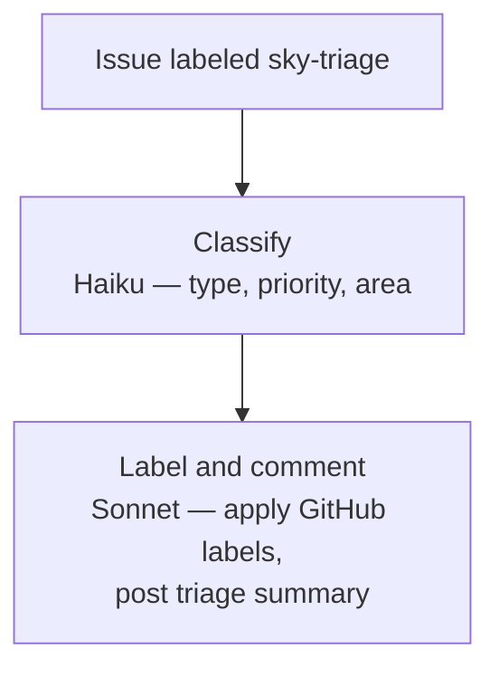

Gebruik dit om binnenkomende issues automatisch te classificeren en te labelen. Wanneer iemand een issue indient, voeg je het label `sky-triage` toe en Skylence leest de titel en inhoud, bepaalt het type en de prioriteit, past de juiste labels toe en post een kort triagecommentaar op het issue.

Werkt het best voor repositories met een gestage stroom issues waar handmatige triage een bottleneck vormt. Het `sky-triage` label zelf kan automatisch worden toegevoegd via een GitHub Actions workflow die wordt geactiveerd bij aanmaken van een issue.

**Trigger:** Voeg label `sky-triage` toe aan issue.



Handig voor grote backlog zonder handmatige triage.

```
⊕meta⊕
name = "issue-triage"
description = "Classify new issue, apply labels and triage comment"
trigger.github.events = ["issues.labeled"]
trigger.github.label = "sky-triage"
output_style = "terse"
⊕⊕

※※
This workflow fires when you add the "sky-triage" label to a GitHub issue.
It automatically reads the issue title and body, determines what kind of issue it is,
how urgent it is, and which part of the system it affects — then applies the right labels
and posts a short triage comment so the issue is ready for prioritization.

This is ideal for repositories that receive many issues. The "sky-triage" label can itself
be added automatically by a GitHub Actions workflow on every new issue creation, making
triage fully hands-off.
※※

§classify§
model = "haiku"
§§

∆classify∆
Classify issue #{{issue.number}}: {{issue.title}}

Body: {{issue.body}}

Triage flow (Mermaid):
flowchart TD
    issue[Issue title and body] --> classify[Haiku: classify]
    classify --> type[type: bug/feature/enhancement/question/docs/wontfix]
    classify --> priority[priority: low/medium/high]
    classify --> area[area: component or subsystem name]
    type --> label[label node]
    priority --> label
    area --> label
    label --> apply[Apply GitHub labels]
    apply --> comment[Post triage comment]

Type:
- bug: broken behavior, error, crash, regression
- feature: new capability, net-new
- enhancement: improve existing behavior
- question: needs clarification or support
- docs: missing or incorrect documentation
- wontfix: out of scope

Priority:
- high: blocks users or production
- medium: friction with workaround
- low: nice-to-have or polish

Output ONLY valid JSON:
{"type": "<type>", "priority": "low|medium|high", "area": "<component>", "reasoning": "<one sentence>"}
∆∆

※※
STEP 1 — CLASSIFY
A fast, cheap model (Haiku) reads the issue title and body and outputs three things:
  type     — what kind of issue is this? (bug, feature, enhancement, question, docs, wontfix)
  priority — how urgent? (high: blocking users, medium: friction with workaround, low: nice-to-have)
  area     — which component or subsystem does this relate to?
This takes only a fraction of a second and costs almost nothing. The result is a small
JSON object that the next step reads to apply labels.
※※

§label§
model = "sonnet"
depends_on = ["classify"]
§§

∆label∆
Apply labels and post triage comment on issue #{{issue.number}}.

Classification: $classify.output

Steps:
1. Create type label if missing: `gh label create "$classify.output.type" --color <sensible hex> 2>/dev/null || true`
2. Create priority label if missing: `gh label create "priority: $classify.output.priority" --color <sensible hex> 2>/dev/null || true`
3. Apply labels: `gh issue edit {{issue.number}} --add-label "$classify.output.type,priority: $classify.output.priority"`
4. Post comment: `gh issue comment {{issue.number}} --body "**Triaged.** Type: $classify.output.type · Priority: $classify.output.priority · Area: $classify.output.area. $classify.output.reasoning"`
∆∆
```
