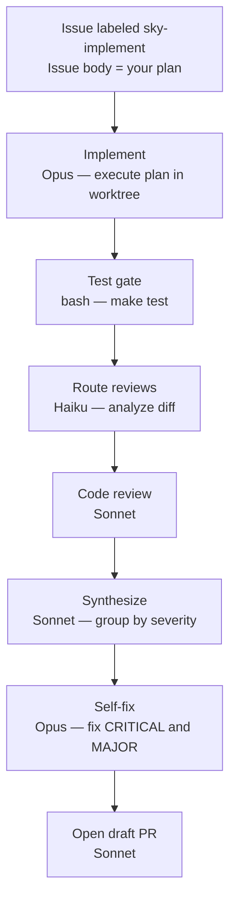

Gebruik dit wanneer je al hebt uitgevogeld wat er moet gebeuren en wil dat Skylence het uitvoert. Schrijf het implementatieplan in de issue-inhoud — zo gedetailleerd of globaal als je wil — voeg dan het label toe en loop weg.

De issue-inhoud wordt ongewijzigd doorgegeven aan Opus. Wees specifiek: noem bestanden, functies en verwacht gedrag. Hoe meer detail je geeft, hoe voorspelbaarder het resultaat.

**Trigger:** Voeg label `sky-implement` toe aan issue.



Schrijf plan in issue-inhoud vóór toevoegen label. Wees specifiek: noem bestanden, functies, wijzigingen.

```
⊕meta⊕
name = "plan-to-pr"
description = "Execute plan from issue body: implement → test → adaptive review → self-fix → PR"
trigger.github.events = ["issues.labeled"]
trigger.github.label = "sky-implement"
output_style = "terse"
⊕⊕

※※
This workflow fires when you add the "sky-implement" label to a GitHub issue.
Unlike fix-github-issue which figures out the plan itself, this workflow treats the
issue body as the plan. Write exactly what you want done — which files, which functions,
what behavior — then label the issue. Skylence executes it step by step and opens a PR.

Be specific in the issue body. The more detail you provide, the more predictable the result.
※※

§implement§
model = "opus"
effort = "max"
isolation = "worktree"
§§

∆implement∆
Execute plan for issue #{{issue.number}}: {{issue.title}}

Plan:
{{issue.body}}

Execution loop (Mermaid):
flowchart TD
    plan[Read task from plan] --> change[Make change]
    change --> test[make test]
    test -->|pass| commit[Commit with issue ref]
    test -->|fail| fix[Fix failure]
    fix --> test
    commit -->|more tasks| plan
    commit -->|done| push[git push -u origin HEAD]

Per task:
- Make change.
- Run `make test`. Fix failures before continuing.
- Commit referencing #{{issue.number}}.

Push on completion: `git push -u origin HEAD`.
∆∆

※※
STEP 1 — IMPLEMENT
Opus reads your issue body as a task list and executes it inside an isolated copy of the
codebase (a git worktree on a fresh branch). For each task it makes the change, runs
"make test", fixes any failures before moving on, then commits with a reference to the
issue. When all tasks are done it pushes the branch to GitHub.
※※

§test§
bash = "make test"
depends_on = ["implement"]
§§

※※
STEP 2 — TEST GATE
An independent bash step runs "make test" as a hard gate before review begins.
If tests are failing here, the workflow knows before spending time on code review.
※※

§review-classify§
model = "haiku"
depends_on = ["implement"]
chain_from = "implement"
§§

∆review-classify∆
Analyze implementation branch. Decide which review agents to run.

Run `git fetch origin && git diff origin/main...HEAD`.

Rules:
- run_error_handling: "true" if diff touches error handling or changes error returns.
- run_test_coverage: "true" if diff modifies source files (not just tests or docs).
- run_docs_impact: "true" if diff adds/removes public APIs, CLI flags, env vars, or config keys.

Output ONLY valid JSON:
{"run_error_handling": "true|false", "run_test_coverage": "true|false", "run_docs_impact": "true|false", "reasoning": "<brief>"}
∆∆

※※
STEP 3 — ROUTE REVIEWS
A fast Haiku model reads the git diff and decides which review checks to run.
Error-handling review only fires if the diff touches error paths.
Test-coverage review only fires if source files changed.
This avoids running unnecessary checks on documentation or config-only changes.
※※

§code-review§
model = "sonnet"
depends_on = ["review-classify"]
chain_from = "review-classify"
§§

∆code-review∆
Review implementation for issue #{{issue.number}}: {{issue.title}}

Run `git fetch origin && git diff origin/main...HEAD`.

Check:
1. Matches plan? Off-by-one, nil dereferences, race conditions?
2. Edge cases — what inputs or states could break this?
3. Conventions — matches adjacent code patterns?
4. Security — injection, path traversal, auth bypass?

List findings: severity (critical/major/minor), file:line, what to fix.
Conclude: LGTM, LGTM with minor fixes, or NEEDS CHANGES.
∆∆

※※
STEP 4 — CODE REVIEW
Sonnet reviews the full diff against your plan: does the implementation match what was asked?
Are there correctness issues, edge cases, or security concerns? Does it follow code conventions?
Findings are listed by severity with file and line references.
※※

§synthesize§
model = "sonnet"
depends_on = ["code-review"]
§§

∆synthesize∆
Synthesize review findings for issue #{{issue.number}}.

Code review: $code-review.output

Group by severity:
- CRITICAL: must fix before merging
- MAJOR: should fix before merging
- MINOR: non-blocking

If no issues: "LGTM — no fixes required."
∆∆

※※
STEP 5 — SYNTHESIZE
All review findings are collected and grouped into CRITICAL / MAJOR / MINOR.
This is the action list that the self-fix step works from.
※※

§self-fix§
model = "opus"
effort = "max"
depends_on = ["synthesize", "implement"]
chain_from = "implement"
§§

∆self-fix∆
Fix CRITICAL and MAJOR findings for issue #{{issue.number}}.

Findings: $synthesize.output

Continue from implementation branch. Run `git fetch origin && git checkout <branch>` if needed.

- Fix CRITICAL and MAJOR. Fix MINOR if trivial.
- Run `make test`. Commit and push.
- If "LGTM — no fixes required", confirm and stop.
∆∆

※※
STEP 6 — SELF-FIX
Opus fixes every CRITICAL and MAJOR finding from the review, runs tests again,
commits the fixes, and pushes. If review said "no issues", this step confirms and skips.
※※

§create-pr§
model = "sonnet"
depends_on = ["test", "self-fix"]
trigger_rule = "all_done"
§§

∆create-pr∆
Create PR for issue #{{issue.number}}: {{issue.title}}

Test: $test.output
Review: $synthesize.output

1. Confirm committed: `git status`
2. Push if needed: `git push -u origin HEAD`
3. Check existing: `gh pr list --head $(git branch --show-current)`
4. Create draft: `gh pr create --draft`
   - Title: imperative, under 70 chars
   - Body: summary, `Closes #{{issue.number}}`, review summary
∆∆
```
