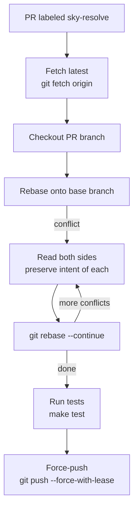

Gebruik dit wanneer een pull request achterop is geraakt bij de basisbranch en merge-conflicten heeft opgebouwd. Skylence checkt de branch uit, rebaset hem en lost elk conflict op door beide kanten te lezen en de intentie van beide wijzigingen te bewaren.

Als de oplossing dubbelzinnig is, geeft het de voorkeur aan de PR-branch wijziging en noteert de beslissing in het rapport. Na het oplossen draait het je testsuite om te bevestigen dat niets is kapotgegaan.

**Trigger:** Voeg label `sky-resolve` toe aan pull request.



Eén-node workflow — taak eenvoudig genoeg voor één Sonnet-pass.

```
⊕meta⊕
name = "resolve-conflicts"
description = "Resolve merge conflicts on PR branch, run tests, push resolution"
trigger.github.events = ["pull_request.labeled"]
trigger.github.label = "sky-resolve"
output_style = "terse"
⊕⊕

※※
This workflow fires when you add the "sky-resolve" label to a pull request.
It handles the entire rebase automatically: fetching the latest base branch, checking out
the PR branch, running git rebase, and for each merge conflict reading both sides to
understand the intent of each change and producing a resolution that preserves both.

After all conflicts are resolved it runs your test suite to confirm nothing broke,
then force-pushes the rebased branch back to GitHub. The PR is back in a mergeable state.
※※

§resolve§
model = "sonnet"
§§

∆resolve∆
Resolve merge conflicts in PR #{{pull_request.number}}: {{pull_request.title}}

Branch: {{pull_request.head.ref}}
Base: {{pull_request.base.ref}}

Resolution flow (Mermaid):
flowchart TD
    fetch[git fetch origin] --> checkout[checkout PR branch]
    checkout --> rebase[git rebase base branch]
    rebase -->|conflict| read[Read both sides]
    read --> resolve[Preserve intent of both]
    resolve --> continue[git rebase --continue]
    continue -->|more conflicts| read
    continue -->|done| test[make test]
    test -->|pass| push[git push --force-with-lease]
    test -->|fail| debug[Fix test failures]
    debug --> test

Steps:
1. Fetch: `git fetch origin`
2. Checkout: `git checkout {{pull_request.head.ref}}`
3. Rebase: `git rebase origin/{{pull_request.base.ref}}`
4. Per conflict:
   - Read both sides.
   - Preserve intent of both where possible.
   - If ambiguous, prefer PR branch change and note decision.
5. Continue: `git rebase --continue`
6. Test: `make test`
7. Push: `git push --force-with-lease origin {{pull_request.head.ref}}`
8. Report: conflicts resolved, decisions made, test result.
∆∆
```
