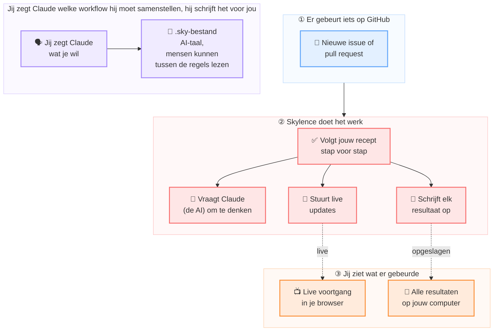

## Wat is Skylence?

Skylence is een Claude Code **harness builder**. Je geeft het `.sky`-workflowbestanden; het bouwt en runt een harness voor elk passend GitHub-event — roept de `claude` CLI aan, streamt resultaten via WebSocket en slaat alles lokaal op.

## Waarom dit bestaat

Ik zag een YouTuber [Archon](https://archon.diy) demonstreren, een Claude Code harness builder. Ik probeerde het zelf met een paar zorgvuldig uitgewerkte workflows. Authenticatie toevoegen aan een simpele Laravel todos-app duurde 45 tot 50 minuten van begin tot eind. Te traag.

Later botste ik op [Weft](https://weavemind.ai) van WeaveMindAI, een DAG-taal voor AI-workflows. En ik merkte dat GitNexus een web-UI had: `gitnexus serve` verbindt de CLI ermee.

Die drie klikten. Ik wou één bestandsformaat dat AI-first was, zodat Claude het kon schrijven met strakke, efficiënte prompts, maar nog leesbaar genoeg voor mensen om te reviewen voor het ging draaien. Claude draait het bestand niet zelf. Skylence leest het, bouwt de DAG, en roept de `claude` CLI aan voor het denkwerk.

Laten we eerlijk zijn: niemand schrijft deze workflowbestanden nog met de hand. Iedereen grijpt naar een LLM. Als de LLM het toch schrijft, kan hij net zo goed prompts afleveren die op zichzelf afgestemd zijn in plaats van aangekleed voor ons. De tekst tussen de blokken staat er puur zodat een mens het kan volgen en goedkeuren voor het draait.

Zo ontstond `.sky`.

## Hoe het werkt

1. Een GitHub-event (issue gelabeld, PR geopend, …) triggert een bijpassende workflow.
2. Skylence voert elke node in afhankelijkheidsvolgorde uit — Claude aanroepen, shellcommando's uitvoeren of HTTP-verzoeken doen.
3. Elke stap wordt live gestreamd en lokaal opgeslagen. Niets verlaat je machine.

## Mogelijkheden

- **Gestructureerde workflows** — definieer meerstaps-DAGs met afhankelijkheden, condities en loops in `.sky`-bestanden.
- **Claude-native** — gebruikt `claude` CLI-sessies, MCP-configuratie en isolatievlaggen direct.
- **Kostenbeheer** — uitgavenlimieten per node en per maand, gehandhaafd voordat Claude wordt aangeroepen.
- **Veiligheid bij parseren** — `sky lint` detecteert injectierisico's en schemafouten voordat een workflow start.
- **Lokaal-eerst** — geen account, geen cloud-backend. State opgeslagen in SQLite op je eigen machine.
- **Live streaming** — run-events stromen via WebSocket naar de [sandbox.skylence.be](https://sandbox.skylence.be) SPA.

## Verder gaan

| | |
|---|---|
| [Installatie](/nl/installation/) | Installeer de `sky` binary |
| [Aan de slag](/nl/getting-started/) | Voer je eerste workflow uit |
| [Workflow-formaat](/nl/workflow-format/) | Leer het `.sky`-bestandsformaat |
| [CLI-referentie](/nl/cli/) | Alle commando's en vlaggen |
| [Configuratie](/nl/configuration/) | Configuratiebestand en env vars |
| [Architectuur](/nl/architecture/) | Hoe de onderdelen samenhangen |
