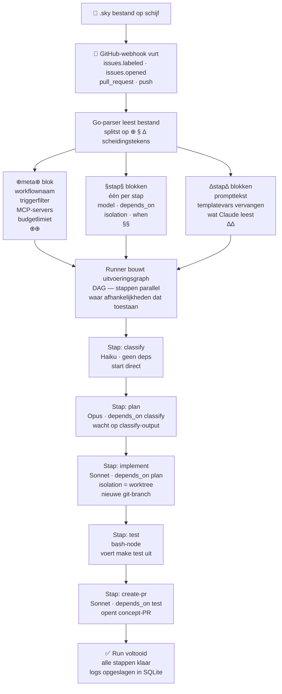

import { Aside } from '@astrojs/starlight/components';

Hoe een `.sky`-bestand van tekst op schijf naar Claude die stappen uitvoert gaat — van trigger tot PR.

---

## Van bestand naar uitvoering

---

## Wat er in elke fase gebeurt

**Parseren** — Go leest het bestand van boven naar onder. De drie scheidingstekentypes worden geëxtraheerd in aparte maps: één meta-blok, N stapconfiguratieblokken, N promptblokken. Onbekende scheidingstekentypes worden afgewezen.

**DAG-opbouw** — De runner doorloopt de `depends_on`-arrays en bouwt een gerichte acyclische graph. Cykels worden direct gedetecteerd en breken de run af. Stappen zonder `depends_on` zijn rootknopen en starten direct.

**Templatevervanging** — Voordat Claude een `∆`-blok ziet, vervangt de runner `{{var}}`-tokens door velden uit de triggerende webhook-payload. Onbekende vars worden lege strings (gemarkeerd door `sky lint`).

**Stapuitvoering** — Elk staptype heeft een andere uitvoerder:
- `command` / `prompt` → Claude-subprocess met samengestelde context
- `bash` → shell-uitvoering met geïnjecteerde `$SKY_*`-omgevingsvariabelen
- `http` → uitgaande HTTP-call met vervangen body/headers
- `eval` → bewering gecontroleerd tegen output van eerdere stap
- `wait` → blokkeert totdat mens goedkeurt via UI of webhook-callback

**Worktree-isolatie** — Stappen met `isolation = "worktree"` krijgen een nieuwe git-branch en werkdirectory. Claude kan bestandswijzigingen aanbrengen en commando's uitvoeren zonder de hoofdbranch te beïnvloeden. De worktree wordt samengevoegd of verwijderd wanneer de stap klaar is.

**Outputpropagatie** — De output van elke stap wordt opgeslagen en is beschikbaar voor latere stappen via `{{steps.id.output}}`-templatevars of `$SKY_OUTPUT_<STAP_ID>`-omgevingsvariabelen in bash-nodes.

---

<Aside type="tip" title="chain_from — een Claude-sessie voortzetten">
  Gebruik `chain_from = "stap-id"` om Claude de volledige gespreksgeschiedenis van een eerdere stap te geven. Handig wanneer een reviewstap volledige context nodig heeft van wat geïmplementeerd is — zonder de code opnieuw in de prompt te sturen.
</Aside>

<Aside type="caution" title="trigger_rule bepaalt fan-in-gedrag">
  Wanneer meerdere stappen in één samenkomen, bepaalt `trigger_rule` wanneer die vurt:
  - `all_done` (standaard) — wacht op alle afhankelijkheden ongeacht resultaat
  - `all_success` — alleen vuren als alle afhankelijkheden geslaagd zijn
  - `one_success` — vurt wanneer één afhankelijkheid slaagt
  - `one_failure` — vurt wanneer één afhankelijkheid mislukt (handig voor foutafhandelingsstappen)
</Aside>
