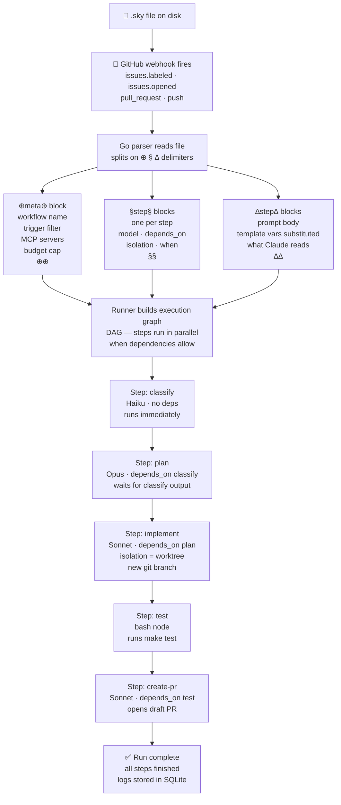

import { Aside } from '@astrojs/starlight/components';

How a `.sky` file goes from text on disk to Claude executing steps — from trigger to PR.

---

## From file to execution

---

## What happens at each stage

**Parse** — Go reads the file top to bottom. The three delimiter types are extracted into separate maps: one meta block, N step-config blocks, N prompt blocks. Unknown delimiter types are rejected.

**DAG build** — The runner walks the `depends_on` arrays and builds a directed acyclic graph. Cycles are detected and abort the run immediately. Steps with no `depends_on` are root nodes and start executing right away.

**Template substitution** — Before Claude sees any `∆` block, the runner replaces `{{var}}` tokens with fields from the triggering webhook payload. Unknown vars become empty strings (flagged by `sky lint`).

**Step execution** — Each step type has a different executor:
- `command` / `prompt` → Claude subprocess with the assembled context
- `bash` → shell exec with `$SKY_*` env vars injected
- `http` → outbound HTTP call with substituted body/headers
- `eval` → assertion checked against a prior step's output
- `wait` → blocks until human approves via UI or webhook callback

**Worktree isolation** — Steps with `isolation = "worktree"` get a fresh git branch and working directory. Claude can make file changes and run commands without affecting the main branch. The worktree is merged or discarded when the step finishes.

**Output propagation** — Each step's output is stored and available to later steps via `{{steps.id.output}}` template vars or `$SKY_OUTPUT_<STEP_ID>` env vars in bash nodes.

---

<Aside type="tip" title="chain_from — continuing a Claude session">
  Use `chain_from = "step-id"` to hand Claude the entire conversation history from a previous step. Useful when a review step should have full context of what was implemented — without re-sending the code in the prompt.
</Aside>

<Aside type="caution" title="trigger_rule controls fan-in behaviour">
  When multiple steps feed into one, `trigger_rule` determines when it fires:
  - `all_done` (default) — wait for all dependencies regardless of outcome
  - `all_success` — fire only if all dependencies succeeded
  - `one_success` — fire when any one dependency succeeds
  - `one_failure` — fire when any one dependency fails (useful for error-handling steps)
</Aside>
